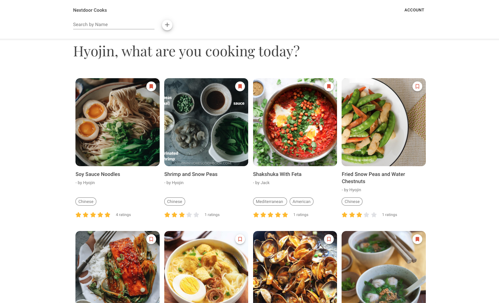

# Nextdoor Cooks #
by [Hyojin](https://github.com/jinnic)

<kbd>
    
</kbd>

### About ###

Food recipe social media app that provides a platform to share diverse cultural heritage, create social connection and understanding through food. 

Nextdoor Cooks allows a user to:
* Sign up and create an account.
* Edit their account details.
* Create a recipe, edit recipes, and delete recipes.
* View and bookmark the recipes of other users.
* View only recipes user bookmarked.
* Comment and rate recipes.
* Search recipes by name and cuisine type.
* Remain auto logged in after sign-up/log-in.

### Built With ###
* [Frontend](https://github.com/jinnic/nextdoorcooks_frontend): React, Redux, Sass
* [Backend](https://github.com/jinnic/nextdoorcooks_backend): Ruby On Rails, PostgreSQL, JWT, Cloudinary, Serializer

### Features ###
* JWT Token Auth and auto login
* Dynamic form to create recipe
* Clean custom design

### Resources used ###
* [Figma](https://www.figma.com/) - Creating mockups/prototypes for site layout and design
* [Trello](https://trello.com/) - Manage project and track progress
* [Cloudinary](https://cloudinary.com/) - A cloud service to upload images and videos
* [React Redux & Redux Thunk](https://react-redux.js.org/) - Single source of truth for data
* [React Router](https://reactrouter.com/web/guides/quick-start) - Client-side Routing for smooth and fast experiance
* [SASS](https://sass-lang.com/) - Custom styling
* [JWT](https://jwt.io/) - JSON Web Token for auto login

